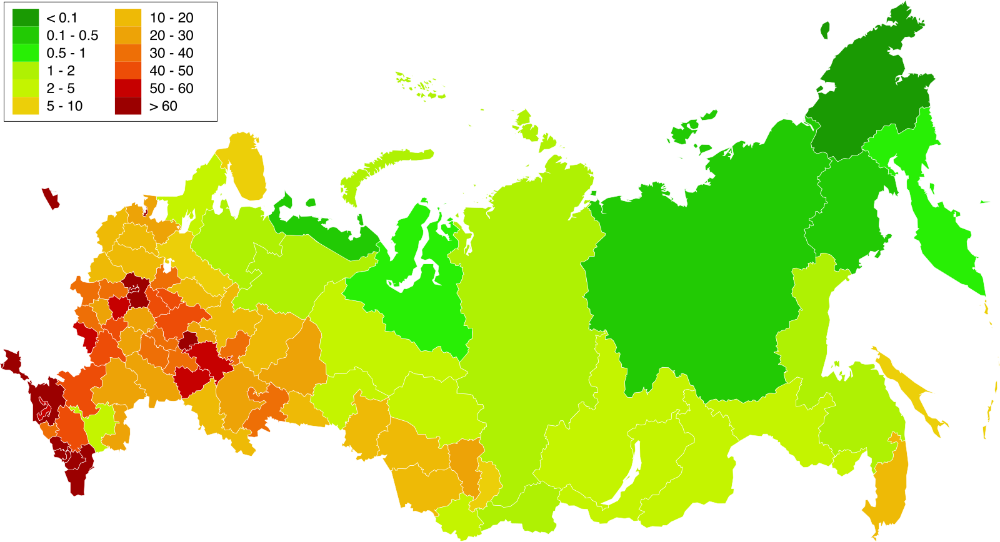

# Highload_Cloud_mail.ru
Облако mail.ru - облачный сервис для хренения и обмена файлами, популярный на территории стран СНГ.

### Функционал MVP:
- Регистрация, авторизация;
- Загрузка и удаление файлов;
- Скачивание файла с хранилища;
- Создание директорий и перемещение файлов между ними;
- Показ списка всех файлов директории (листинг);
- Уравление видимостью файлов (недоступно никому кроме владельца, доступно только по ссылке, доступно всем).

### Целевая аудитория [[1]](#источники):
| Страна             | Процент аудитории | 
|--------------------|-------------------|
| **Россия**         | 86.48%            |
| **Беларусь**       | 3.23%             |
| **Казахстан**      | 3.07%             |
| **Турция**         | 1.32%             |

# Рассчет нагрузки

#### Известно [[2]](#источники):
- MAU (2022): 23 млн пользователей. 
- DAU (2022): 2,5 млн.

#### Предположение:
В 2025 можно взять x1.5 по числу пользователей. 

### Продуктовые метрики:
- 35M MAU;
- 4M DAU;
- Общий объем данных 335 петабайт [[3]](#источники);
- Пользователи загрузили 5,8 млрд файлов (за 2 месяца в 2025) [[3]](#источники).

#### Известно [[3]](#источники):
- Количество хранимых уникальных файлов (2025): 45,5 млрд+.
- Количество уникальных фотографий (2025) составило 28 млрд, а объём — 70 петабайт. 
- Количество видеофайлов составило 2,5 млрд.

#### Предположение:
Пусть средний размер стороннего файла составляет ~5 МБ.
Тогда видео заниют `335 ПБ - 70 ПБ - (15млрд * 5 МБ) = 190 ПБ`
и составляют 56.7% всего хранилища

### Размер хранения:
| Тип файлов         | Количество файлов | Объём (ПБ) | Доля от общего объёма | Средний размер файла |
|--------------------|-------------------|------------|----------------------|----------------------|
| **Фотографии**     | 28 млрд          | 70 ПБ      | 20.9%                 | ~2.5 МБ             |
| **Видео**          | 2,5 млрд         | 190 ПБ     | 56.7%                 | ~76 МБ               |
| **Сторонние файлы**| 15 млрд          | 75 ПБ      | 22.4%                 | ~5 МБ               |
| **Всего**          | 45,5 млрд        | 335 ПБ     | 100%                  | ~7.4 МБ             |

### RRS по API:
| Метод API                     | Формула расчета                          | Средний RPS | Пиковый RPS (x2.5) |
|-------------------------------|------------------------------------------|-------------|---------------------|
| **Авторизация**               | `4 млн / 86400 с`                        | 50          | 125                 |
| **Регистрация**               | `50 RPS * 0.01`                          | 0.5         | 1.3                 |
| **Загрузка файла**            | `2.9 млрд / (31 д * 86400 с)`            | 1100        | 2750                |
| **Удаление файла**            | `1100 RPS * 0.2`                         | 220         | 550                 |
| **Скачивание файла**          | `1100 RPS * 1,5`                         | 1650        | 4125                |
| **Создание директории**       | `50 RPS * 0.1`                           | 5           | 12.5                |
| **Листинг файлов**            | `50 RPS * 5`                             | 250         | 625                 |
| **Изменение видимости файла** | `250 RPS * 15 файлов * 0.05`             | 200         | 500                 |
| **Итого**                     |  `Сумма RPS`                             | **~3500**   | **~8750**           |

*Согласовано с RPS Dropbox с учетом разницы в DAU и MAU [[4]](#источники)

Средний размер файла для загрузки (80% - фото): `0,8 * 2,5 MБ + 0,15 * 5 MБ + 0,05 * 76 MБ = 6.5 MБ`
Средний размер файла для скачивания: `335 ПБ / 45,5 млрд файлов ≈ 7,4 МБ`

| Метод API | Размер данных | Пиковый трафик (Гбит/с) | Суточный трафик (ГБ/сутки) |
| :--- | :---: | :---: | :---: |
| **Загрузка файла** | 6.5 МБ | ~143 | ~600 000 |
| **Скачивание файла** | 7,4 МБ | ~230 | ~1 000 000 |
| **Авторизация** | 10 КБ | ~0.02 | ~8.64 |
| **Регистрация** | 10 КБ | ~0.0002 | ~0.086 |
| **Удаление файла** | 10 КБ | ~0.088 | ~38 |
| **Создание директории** | 10 КБ | ~0.002 | ~0.864 |
| **Листинг файлов** | 30 КБ | ~0.15 | ~648 |
| **Изменение видимости** | 10 КБ | ~0.08 | ~34.56 |благо
| **ИТОГ** | | ~375 | ~1 600 000 |

# Глобальная балансировка

### Функциональное разбиение по доменам
| Домен | Назначение | Методы API |
| :--- | :--- | :--- |
| **`cloud.mail.ru`** | Главный домен | Авторизация, Регистрация |
| **`meta.cloud.mail.ru`** | Управление метаданными файлов и папок | Создание директории, Листинг, Изменение видимости |
| **`data-XX.cloud.mail.ru`** (XX-номер региона) | Операции с файлами | Загрузка, Скачивание, Удаление файлов |

### Расположение ДЦ
Согласно тому, что сервисом в основном пользуются граждане Росси, Беларуси и Казахстана, 
то все ДЦ можно расположить внутри РФ. 

Согласно карте плотности населения и списку городов миллионников [[5]](#источники):
| Домен | Города |
| :--- | :--- |
| **`cloud.mail.ru`** | Москва |
| **`meta.cloud.mail.ru`** | Москва |
| **`data-XX.cloud.mail.ru`** (S3)| Москва, СПб, Краснодар, Екатеринбург, Новосибирск, Хабаровск |

### Схема балансировки (Latency-Based DNS)
- У каждого ДЦ свой домен. Благодаря Latency-Based DNS пользователь перенаправляется на ближайший региональный ДЦ.
- Пользователи загружают/скачивают файлы в основном с одного и того же регионального ДЦ.

# Локальная балансировка
### Схема для доменов **`cloud.mail.ru`** и **`meta.cloud.mail.ru`**
- При помощи DNS весь трафик попадает на один IP в ДЦ
- Затем внутри ДЦ через L4 (Virtual Server via Direct Routing + Keepalived) трафик распределяется на ноды NginX (L7)
- Изменение количества нод NginX автоматически детектится Keepalived и L4 автоматически подстраивается
- На каждой ноде NginX установлен единый TLS session ticket (для Termination SSl)
- NginX реализует least connection балансировку для инстансов бэкенда
- Кластером инстансов бэкенда и Nginx управляет Kubernetes
#### Дополнительно для **`data-XX.cloud.mail.ru`** (S3) 
- Используются поддомены: api.data-XX.cloud.mail.ru, s3.data-XX.cloud.mail.ru
##### Загрузка файлов
- Client → api.data-XX.cloud.mail.ru/upload/* → -//- (Backend [Auth]) → возвращаем клиенту { "upload_url": "https://s3.data-XX/*" }
- Client → s3.data-XX.cloud.mail.ru/bucket/* → L4 (SSL Termшination  + HealthCheck, NginX в stream mode) → S3 Gateway (Кэширование) → Object Storage
##### Скачивание файлов
- Client → api.data-XX.cloud.mail.ru/download/* → -//- (Backend [Auth]) → возвращаем клиенту { "download_url": "https://s3.data-XX/*" }
- Client → s3.data-XX.cloud.mail.ru/bucket/* → L4 (SSL Termшination + HealthCheck, NginX в stream mode) → S3 Gateway (Кэширование) → Object Storage

### Источники:
1. [Be1.ru - Статистика Cloud.Mail.ru](https://be1.ru/stat/cloud.mail.ru)
2. [habr.com - данные о пользователях за 2022](https://habr.com/ru/news/711772/?ysclid=mfbpt8ybjf200216558)
3. [habr.com - данные о данных в 2025](https://habr.com/ru/news/887932/)
4. [brizfeel.com - статистика Dropbox](https://brizfeel.com/dropbox-subscribers-users-statistics/)
5. [Риа Новости - города миллионники РФ](https://ria.ru/20250226/goroda-1832007799.html?ysclid=mfza7mes6l4067739)
